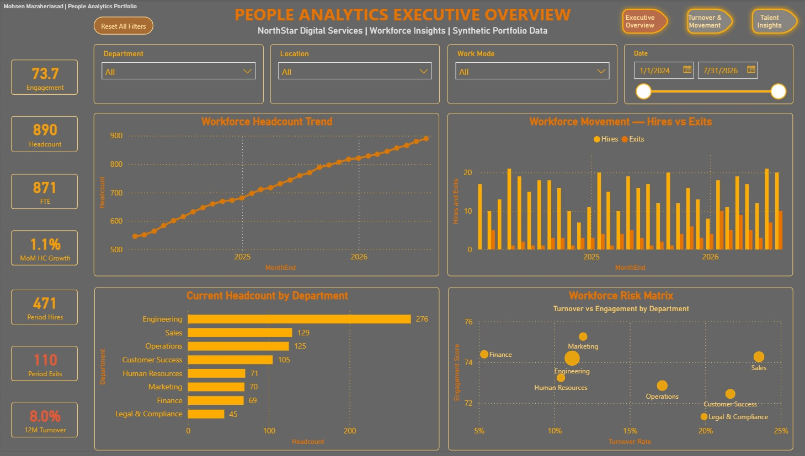
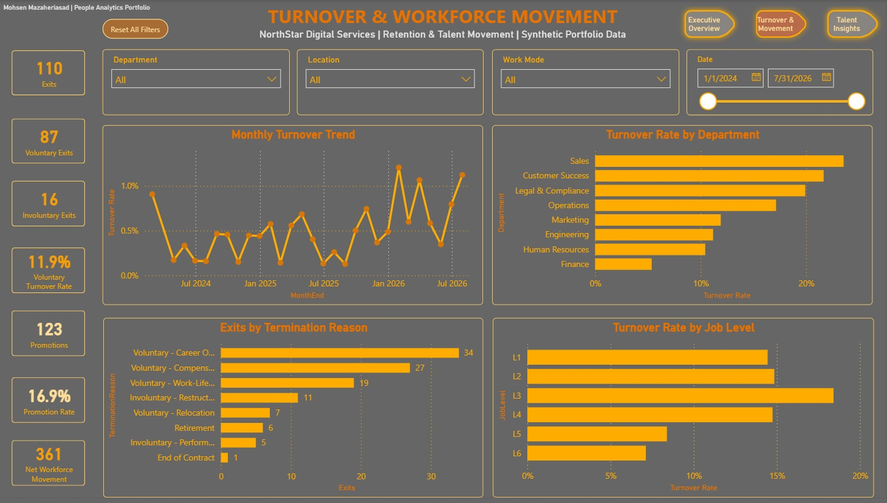
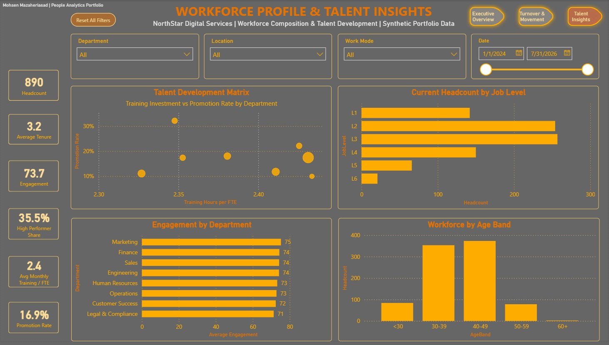

# People Analytics Executive Dashboard
# Created by Mohsen Mazaheriasad

A portfolio project demonstrating end-to-end People Analytics in Power BI: data quality, semantic modeling, DAX, executive reporting, retention diagnostics, talent insights, and management recommendations.

> **Portfolio note:** NorthStar Digital Services is a fictional organization and all workforce data in this repository is synthetic. No real employee or client data is used.

## Project overview

**Objective:** Build an interactive People Analytics solution that helps leaders understand workforce growth, turnover, retention risk, engagement, talent development, and workforce composition.

**Reporting period:** January 2024 - July 2026  
**Synthetic employee records:** 1,000  
**Monthly workforce snapshots:** 22,586  
**Current headcount:** 890  
**Current FTE:** 871.2

## Business questions

- How is workforce size changing over time?
- Where are turnover and retention risks concentrated?
- Why are employees leaving?
- Which job levels and departments require deeper retention analysis?
- How do engagement, promotion, training, tenure, and performance differ across the workforce?
- Which workforce segments should leaders prioritize?

## Dashboard pages

### 1. Executive Overview



Key components:
- Headcount, FTE, MoM headcount growth, period hires, period exits, engagement, and 12M turnover
- Workforce headcount trend
- Hires vs exits
- Current headcount by department
- Workforce risk matrix: turnover vs engagement by department

### 2. Turnover & Workforce Movement



Key components:
- Exits, voluntary exits, involuntary exits, voluntary turnover, promotions, promotion rate, net workforce movement
- Monthly turnover trend
- Turnover rate by department
- Exits by termination reason
- Turnover rate by job level

### 3. Workforce Profile & Talent Insights



Key components:
- Headcount, average tenure, engagement, high performer share, average monthly training hours/FTE, promotion rate
- Talent development matrix
- Current headcount by job level
- Engagement by department
- Workforce distribution by age band

## Data model

The Power BI model follows a simple star-schema design:

- `DimEmployee` - employee-level attributes and lifecycle dates
- `DimDate` - shared date dimension
- `FactWorkforceSnapshot` - monthly employee snapshots
- `_Measures` - centralized DAX measure table

Key relationships:
- `DimEmployee[EmployeeID]` -> `FactWorkforceSnapshot[EmployeeID]` (1:*)
- `DimDate[Date]` -> `FactWorkforceSnapshot[SnapshotMonth]` (1:*, active)
- `DimDate[Date]` -> `DimEmployee[HireDate]` (inactive)
- `DimDate[Date]` -> `DimEmployee[TerminationDate]` (inactive)

Inactive date relationships are activated in DAX using `USERELATIONSHIP()` for hires and exits.

## Core metrics

Examples of measures developed for the project:
- Headcount
- FTE
- Hires
- Exits
- Voluntary Exits
- Involuntary Exits
- Average Headcount
- Turnover Rate
- 12M Turnover Rate
- Voluntary Turnover Rate
- MoM Headcount Growth
- Average Engagement
- Average Tenure
- Promotions
- Promotion Rate
- High Performer Share
- Absence Days per FTE
- Training Hours per FTE
- Net Workforce Movement

See [`data/kpi_dictionary.csv`](data/kpi_dictionary.csv) for metric definitions.

## Key findings

1. **Workforce growth was strong.**  
   Current headcount reached **890**, with **471 hires** and **110 exits** during the reporting period, resulting in **+361 net workforce movement**.

2. **Voluntary exits dominate workforce loss.**  
   **87 of 110 exits (79.1%)** were voluntary.

3. **Three reasons explain most voluntary exits.**  
   Career opportunity (34), compensation (27), and work-life balance (19) accounted for **80 exits**, or approximately **92% of voluntary exits**.

4. **Retention risk is concentrated in specific departments.**  
   Turnover was highest in:
   - Sales: **23.6%**
   - Customer Success: **21.7%**
   - Legal & Compliance: **19.9%**
   - Operations: **17.1%**

   Finance had the lowest turnover at **5.4%**, making it a useful internal benchmark.

5. **L3 is the most exposed job level.**  
   L3 turnover was approximately **18.4%**, the highest among job levels, suggesting a mid-career retention challenge.

6. **The workforce is predominantly mid-career.**  
   Employees aged 30-49 represent approximately **81.6%** of the current workforce.

7. **Talent outcomes differ more than training volume.**  
   Average monthly training hours/FTE are relatively similar across departments (~2.33-2.43), while promotion rates range from **10.0% to 32.2%**. This suggests that career mobility differences may be driven by factors beyond training volume alone.

## Management recommendations

- Prioritize targeted retention actions in Sales, Customer Success, Legal & Compliance, and Operations.
- Investigate career progression, compensation competitiveness, and work-life balance, which account for most voluntary exits.
- Review L3 career paths, internal mobility, pay progression, and promotion readiness.
- Benchmark Finance management practices and employee experience to identify transferable retention practices.
- Examine why similar training investment produces very different promotion outcomes across departments.
- Use the workforce risk matrix as a recurring management review tool rather than relying on organization-wide averages.

## Technical implementation

- Power BI Desktop
- Power Query
- DAX
- Star-schema modeling
- Inactive date relationships with `USERELATIONSHIP()`
- Synced slicers
- Page navigation
- Reset-filter bookmarks
- Interactive tooltips
- Scatter-based workforce risk and talent development matrices

## Repository structure

```text
people-analytics-executive-dashboard/
│
├── README.md
├── data/
│   ├── employee_master.csv
│   ├── monthly_snapshot.csv
│   ├── kpi_dictionary.csv
│   ├── engagement_by_department.csv
│   └── exits_by_termination_reason.csv
├── images/
│   ├── executive_overview.jpg
│   ├── turnover_movement.jpg
│   └── talent_insights.jpg
└── docs/
    └── people_analytics_case_study.pdf
└── powerbi/
    └── people_analytics_executive_dashboard_v1.0.pbix
```

## Data ethics

This project intentionally uses synthetic data. It is designed to demonstrate People Analytics methods without exposing personally identifiable, confidential, or real employee information.

## Portfolio positioning

**Suggested project title:**  
`People Analytics Executive Dashboard | Power BI`

**Skills:**  
People Analytics · Workforce Analytics · Power BI · DAX · Power Query · Data Modeling · HR Analytics · Talent Analytics · Workforce Planning · Data Visualization
